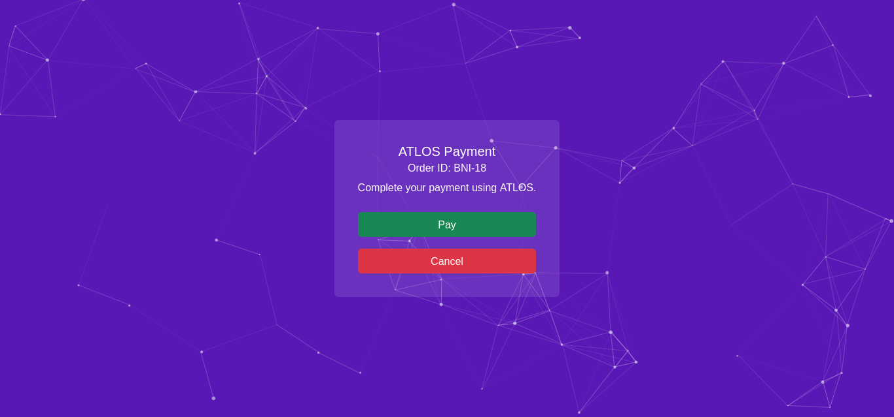
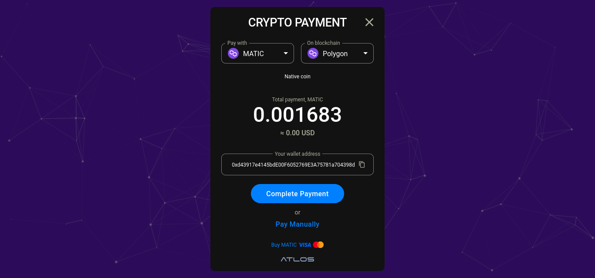
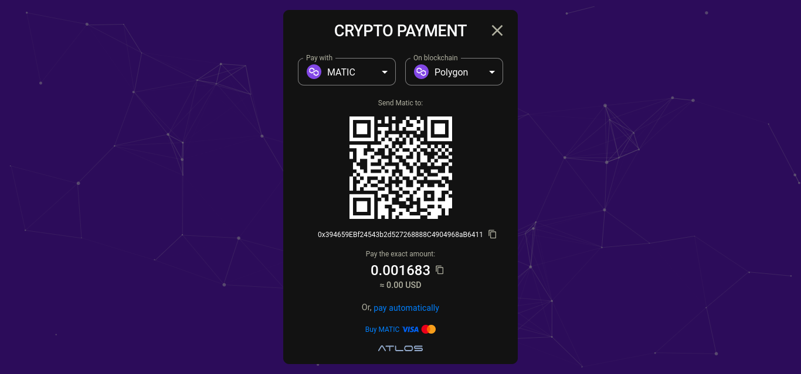
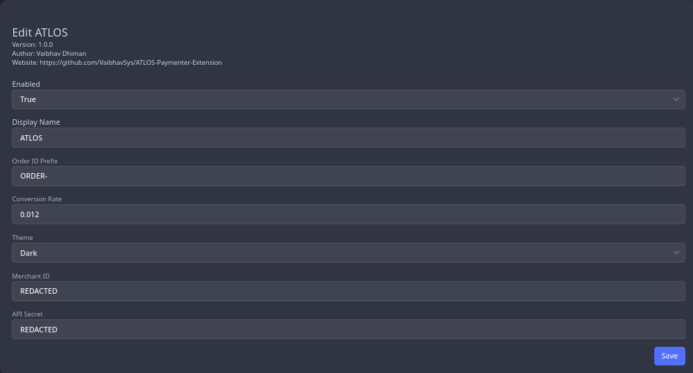

# ATLOS Gateway Extension

This is a gateway extension for Paymenter that integrates the [ATLOS](https://atlos.io/), a permissionless non-custodial crypto payment gateway with no KYC.

Sample Screenshots

Sample Payment:

Sample Light Automatic:

Sample Light Manual:

Sample Dark Automatic:

Sample Dark Manual:

## Getting Started
1. Install the extension
1. Enable the extension
1. Set the Merchant ID
1. Set API Secret
1. Set the conversion rate for selected currency -> USD
1. Choose a theme (default: light)
1. Set an Order ID prefix (optional)
1. Set the Postback URL in [ATLOS Merchant Settings](https://merchants.atlos.io/settings) to `https://<your-paymenter-url>/extensions/atlos/payment/webhook`
1. Done! You are ready to accept payments.

**Note:** The invoice will be marked paid after the transaction has atleast one confirmation on the blockchain.

## Settings
- **Order ID Prefix:** Prefix of the Order ID (eg. ORDER-12345).
**Note:** If you change this while a transaction is pending confirmation on the blockchain, the invoice will not be marked as paid even if the transaction has been confirmed on the blockchain.
- **Conversion Rate:** The conversion rate of the currency set in Paymenter to USD. ATLOS also supports conversion using other Fiat currencies other than USD, so if it is available for your currency and you want to use it, set option this to `-1`.
- **Theme:** This controls the ATLOS theme. Available options are Dark and Light.
- **Merchant ID**: ATLOS Merchant ID. You can get it from [ATLOS Merchant Settings](https://merchants.atlos.io/settings).
- **API Secret**: ATLOS API Secret. You can get it from [ATLOS Merchant Settings](https://merchants.atlos.io/settings).

## Additional Information
This project is licensed under the terms of the MIT license. For more details, see the [LICENSE](LICENSE) file in the repository.

**Note:** The logo is property of ATLOS DAO

The source code for this project is available on GitHub. You can access it [here](https://github.com/VaibhavSys/ATLOS-Paymenter-Extension).
